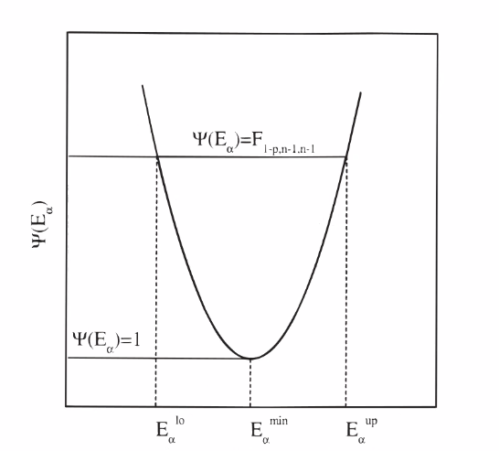

# Picnik UI

A web-based UI built with Streamlit for data analysis and visualization.

## Prerequisites

- **Python 3.13.0** (recommended)
- pip package manager

## Setup Instructions

### 1. Set Python Version

If you have a different Python version installed, use [pyenv](https://github.com/pyenv/pyenv):

```bash
pyenv install 3.13.0
pyenv local 3.13.0
```

### 2. Create Virtual Environment

```bash
python -m venv new_env
source new_env/bin/activate

In cachyOs
source cachyOs_env/bin/activate.fish
```

### 3. Install Dependencies

```bash
sudo apt install python3-pip
pip install -r requirements.txt


In cachyOs
sudo pacman -S python-pip
```

## Running the Application

Start the Streamlit web UI:

```bash
streamlit run main.py
```

The application will be available at `http://localhost:8501`

## Required Modules

- streamlit
- scipy
- seaborn
- picnik
- plotly

## Project Structure

- `main.py` - Main Streamlit application entry point
- `common/` - Shared utilities and helpers
- `views/` - UI page components
- `resources/` - Default data files and resources


TODO: 


el paso 7 puede calcular mas de un metodo para compararlos 


se reciben bounds en unidasdes de energia 
en viasousky


usar checkbox para seleccionar los metodos


dar la opcion de mostrar u ocultar el error

graficar todas las curvas en una misma grafica con la opcion de ocultar cada una


alpha mas chica .002

mas grande .998


para una segunda iteracion calcular que la alpha no sea menor a la diferencia de los datos experimentales


Linux iim-balmaseda 6.17.0-20-generic #20~24.04.1-Ubuntu SMP PREEMPT_DYNAMIC Thu Mar 19 01:28:37 UTC 2 x86_64 x86_64 x86_64 GNU/Linux


to do:

rename p value as p X 100% =  confidence level

Add an ilustration to show the user how to set the min and max boundaries: 
